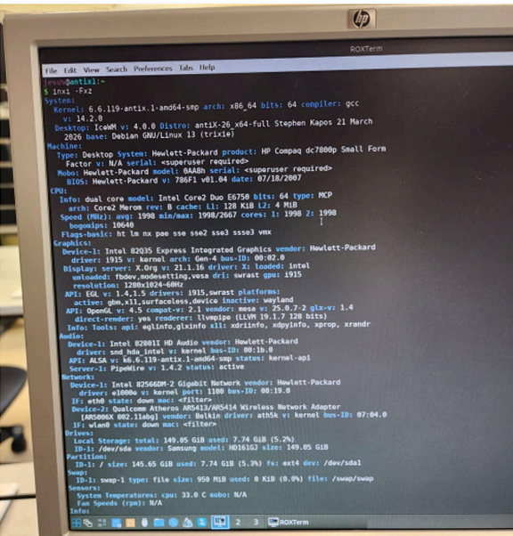
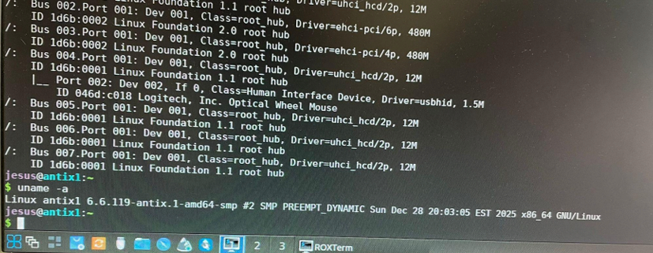
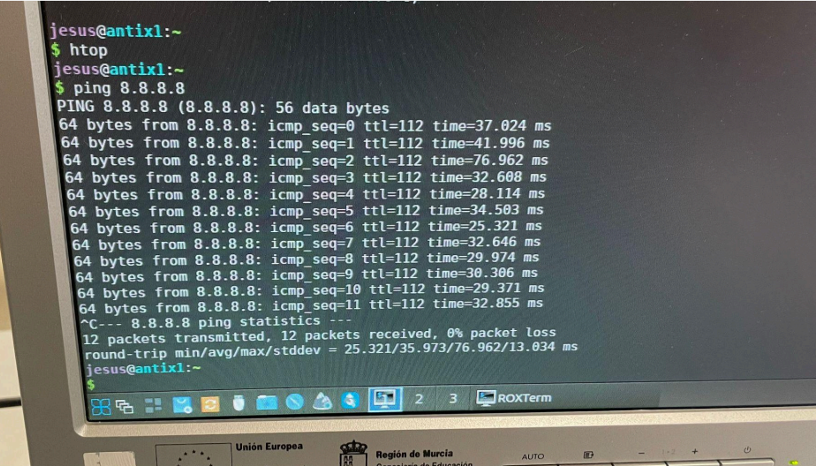
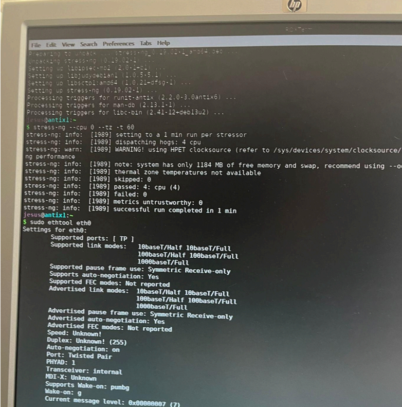
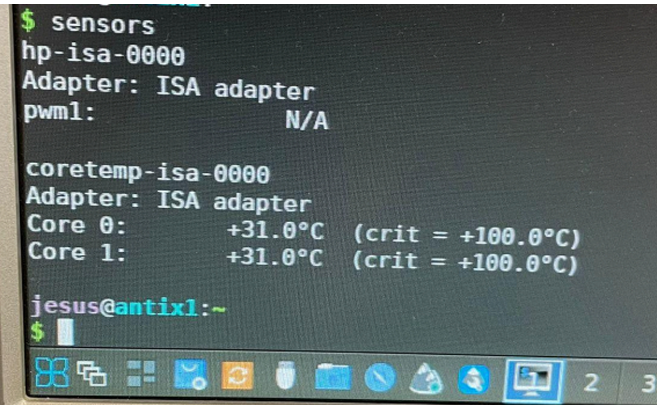
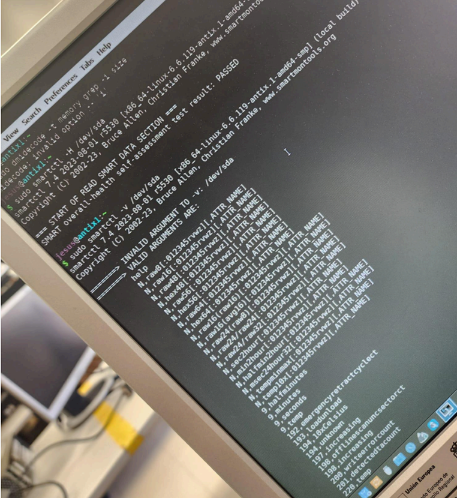
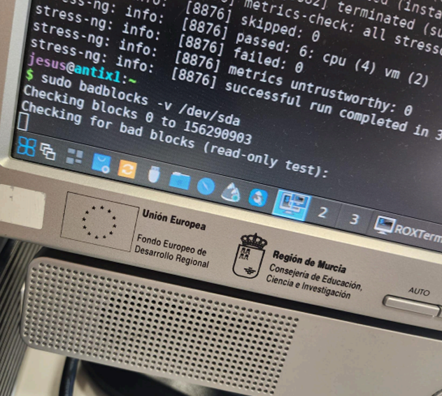
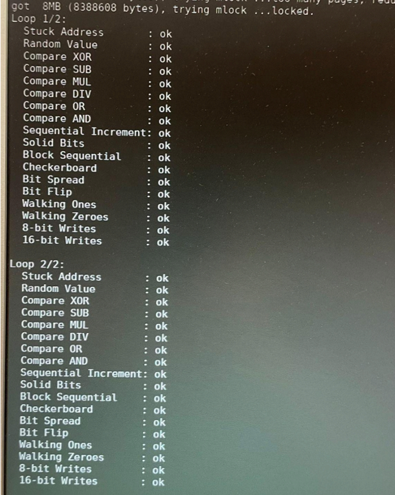
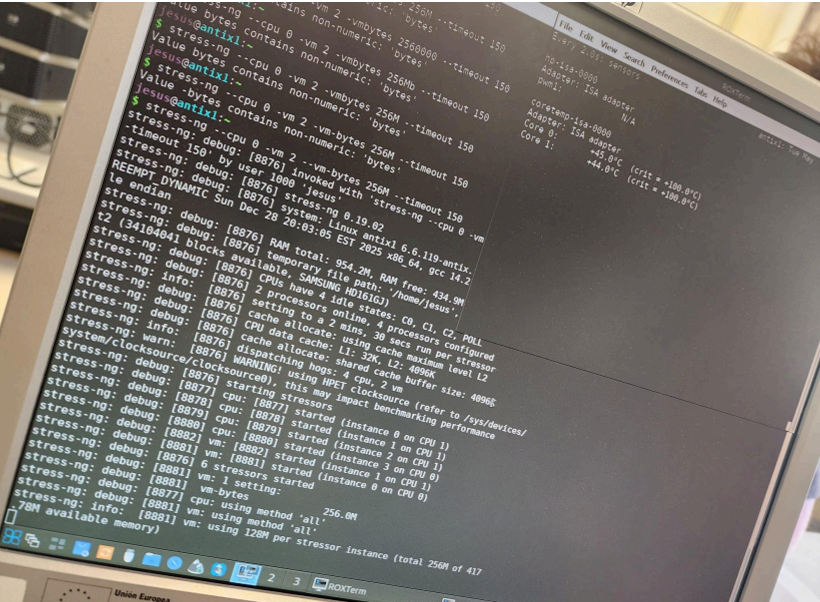
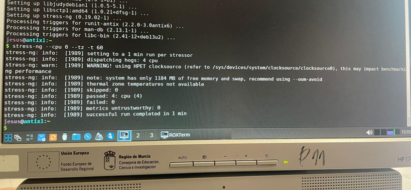

# Reto 01 — RA3: Selección e Instalación de Sistemas Ligeros

---

### Proyecto_RA3_RETO_1

**CIFP Carlos III — ASIR 1º (Bilingüe)**

**Alumno:** José Antonio Rodríguez González

**Fecha:** 11 de abril de 2026

**Módulo:** Fundamentos del Hardware

**Unidad:** RA3 

**Profesor:** Rubén Valentín Caravaca López

**Número de Equipo:** 5

---

# Ejercicio 1: Datos Generales y Hardware

En este primer ejercicio he recogido la informacion basica del equipo y del sistema operativo utilizando los comandos inxi y uname.

---

### Informacion del Sistema y Hardware

**Nombre del Alumno:** José Antonio Rodríguez González
**Fecha:** 15 de mayo de 2026
**Marca y Modelo:** Hewlett-Packard HP Compaq dc7800 Small Form Factor
**Procesador:** Intel Core 2 Duo E6750 (2 núcleos)
**Memoria RAM:** Detectada en el sistema (el comando inxi muestra la gestion del sistema)
**Grafica:** Intel 82Q35 Express Integrated Graphics
**Sistema Operativo:** antiX-26_x64-full (basado en Debian Trixie)
**Version del Kernel:** 6.6.119-antix.1-amd64-smp

---

### Capturas de Pantalla

En esta captura se pueden ver todos los detalles tecnicos del equipo obtenidos con el comando inxi -Fxz.

Aqui se muestra la salida del comando uname -a con la version exacta del kernel y la arquitectura del procesador.

---

# Ejercicio 2: Almacenamiento y Red

En este apartado analizo la capacidad de conexion del equipo y el estado de la tarjeta de red, ademas de monitorizar las temperaturas de trabajo.

---

### Configuracion de Red y Conectividad

Para comprobar que el equipo puede navegar sin problemas, he realizado un test de conectividad hacia los servidores de Google. La respuesta es estable y sin perdida de paquetes. Tambien he verificado las capacidades de la tarjeta de red fisica.

**Tarjeta de Red:** Intel Gigabit Network Connection
**Estado de Red:** Conectado
**Latencia Media:** 35.97 ms

---

### Capturas de Pantalla

Salida del comando ping 8.8.8.8 donde se confirma que el equipo tiene salida a internet.

Detalles de la tarjeta eth0 obtenidos con ethtool, mostrando soporte para velocidades de 10/100/1000 baseT.

Uso del comando sensors para verificar que los nucleos trabajan a una temperatura estable de 31°C, muy lejos del limite critico.

---

# Ejercicio 3: Estado del Disco y Conclusion

En esta ultima parte he comprobado la salud del disco duro y de la memoria RAM junto con pruebas de rendimiento para decidir si el equipo es apto para su uso.

---

### Analisis de Salud y Rendimiento del Hardware

Para verificar el disco duro he lanzado el comando smartctl el cual me indica un resultado de PASSED lo que significa que el disco no tiene fallos. Tambien he pasado un test de bloques dañados y una prueba de memoria donde todos los parametros han dado un resultado de OK. Por ultimo he sometido al equipo a una prueba de estres con stress-ng para ver su estabilidad bajo carga y el sistema ha respondido perfectamente sin errores.

---

### Capturas de Verificacion

Aqui se ve que el test SMART da como resultado PASSED en el dispositivo /dev/sda.

Captura del proceso de busqueda de bloques dañados en el disco duro.

Resultado positivo de los test de escritura y lectura en la memoria del sistema.

Ejecucion del comando stress-ng para poner a prueba los nucleos del procesador y la memoria ram.

Captura donde se confirma que el test de estres ha finalizado con exito despues de un minuto de funcionamiento.

---

### Conclusion Final

**Resultado:** Apto

**Justificacion:** El equipo HP Compaq dc7800 funciona correctamente con la distribucion antiX Linux. Los test de hardware y las pruebas de estres han sido satisfactorios y el sistema reconoce todos los componentes principales manteniendo temperaturas estables. Es un equipo totalmente funcional para tareas basicas de oficina o navegacion por internet.

---

**Nota aclaratoria:** Debido a que mi equipo original sufrio un borrado del sistema operativo por una manipulacion externa antes de poder realizar las capturas yo mismo las imagenes mostradas en este trabajo han sido facilitadas por mis compañeros del Equipo 5 para poder completar la tarea de diagnostico correctamente.

---

